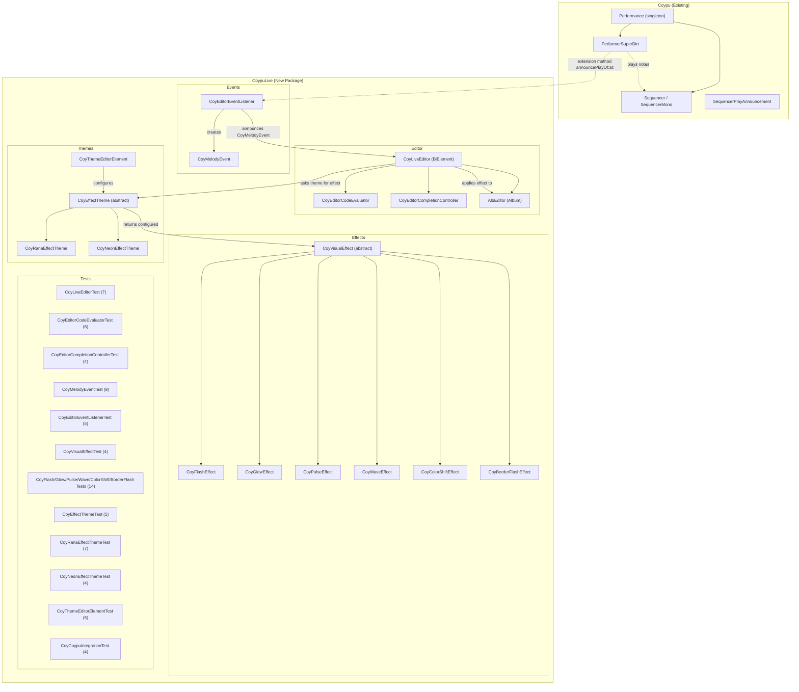

# CoypuLive — Bloc-Based Live Coding Editor with Music-Reactive Visual Effects

A new Pharo package (`CoypuLive`) that provides a **Bloc-based rich text editor** integrated with the [Coypu](https://github.com/lucretiomsp/Coypu) live music domain. The editor executes Pharo code (like the standard Playground), listens for melody/sound events from Coypu's `Performance`/`Sequencer` engine, and renders visual effects on the code text in response to those events — driven by switchable "effect themes."

---

## Background & Context

### Coypu Architecture Summary

Coypu is a Pharo package for live-coding music. Its core domain model:

| Class | Role |
|---|---|
| `Performance` | Singleton `Dictionary` subclass containing all active `Sequencer` tracks. Manages BPM, transport step, and the active `Performer`. |
| `Sequencer` / `SequencerMono` / `SequencerPoly` | A track/clip containing `gates`, `notes`, `durations`, `dirtMessage`, `soundPattern`, `orbit`, `midiChannel`, etc. The basic unit of composition. |
| `Performer` (abstract) → `PerformerSuperDirt`, `PerformerLocal`, `PerformerKyma`, `PerformerPhausto`, `PerformerMIDI` | Selects the audio backend and drives playback. The `playDirt` / `play` loop iterates transport steps, checks gates, and sends OSC/MIDI messages. |
| `CoyEvent` | A scheduled event with `onset` (Fraction) and `value` (note/sample name). Used in the cyclic pattern system. |
| `DirtSingleEvent` | Wrapper for a single SuperDirt OSC message with parameters like `delay`, `delta`, etc. |
| `SequencerPlayAnnouncement` | An **Announcement** class intended to notify visualizations every time a Sequencer plays an event. This is the primary hook for our editor. |
| `RanaTheme` / `RanaThemeConfigurator` | An existing green-phosphor CRT-inspired theme (extends `PharoDarkTheme`). Shows that Coypu already has a theming/visual identity concept. |
| `ByteString` extensions | String-based notation heavily influenced by TidalCycles (e.g., `'bd sn hh'` parsed into patterns). |

### Bloc Framework Key Concepts

| Concept | Description |
|---|---|
| `BlElement` | The fundamental UI building block in Bloc. Everything is a `BlElement`. |
| `BlTextElement` | Renders styled `BlText` (rich text with attributes for color, weight, size, etc.). |
| `AlbEditor` (Album) | A modern text editor widget built on Bloc. Supports text styling, cursors, selection. **This is the foundation for our editor.** |
| `BlAnimation` / `BlSequentialAnimation` / `BlParallelAnimation` | Animation framework for interpolating properties over time. |
| `BlTransformation` | Rotation, scale, translation on elements. |
| `beInSeparateCompositionLayer` | Performance optimization for frequently-updated elements. |
| Alexandrie canvas | Cairo/FreeType/Harfbuzz-based rendering engine used by Bloc. |

---

## Proposed Changes

### Package Structure

The project will be organized as a new Pharo package: **`CoypuLive`** with the following sub-tags (categories):

```
CoypuLive-Editor              "Core editor element and code execution"
CoypuLive-Events              "Music event model for the editor"
CoypuLive-Effects             "Visual effect primitives"
CoypuLive-Themes              "Effect themes (mappings of sound → visual)"
CoypuLive-Themes-Editor       "Preferences UI for creating/switching themes"
CoypuLive-Tests-Editor        "Unit tests for the editor"
CoypuLive-Tests-Events        "Unit tests for events"
CoypuLive-Tests-Effects       "Unit tests for effects"
CoypuLive-Tests-Themes        "Unit tests for themes"
CoypuLive-Tests-Integration   "Integration tests with Coypu"
BaselineOfCoypuLive           "Metacello baseline depending on Coypu + Bloc"
```

---

### Component 1: Baseline & Project Setup

#### [NEW] `BaselineOfCoypuLive`

A Metacello baseline that depends on `BaselineOfCoypu` and the standard Bloc/Album packages already present in modern Pharo images.

```smalltalk
BaselineOfCoypuLive >> baseline: spec
    <baseline>
    spec for: #common do: [
        spec
            baseline: 'Coypu'
            with: [ spec repository: 'github://lucretiomsp/coypu:master' ].
        spec
            package: 'CoypuLive'
            with: [ spec requires: #('Coypu') ] ]
```

---

### Component 2: Core Editor (`CoypuLive-Editor`)

This is the central piece — a Bloc-based code editor that can evaluate Pharo code.

#### [NEW] `CoyLiveEditor` (subclass of `BlElement`)

The main editor element. It composes an `AlbEditor` (the Album text editor widget from Bloc) for text editing and wraps it with Coypu-specific behavior.

**Instance variables:**
```
editor              "AlbEditor — the inner Album text editor widget"
codeContext          "Object — the receiver context for code evaluation (like Playground's self)"
effectTheme          "CoyEffectTheme — the currently active visual effect theme"
eventListener        "CoyEditorEventListener — subscribes to Coypu announcements"
effectLayer          "BlElement — transparent overlay for rendering visual effects on top of code"
activeEffects        "OrderedCollection of CoyVisualEffect — currently playing effects"
```

**Key responsibilities:**
- **Initialization:** Create the `AlbEditor`, set up Pharo syntax highlighting, configure keyboard shortcuts (Cmd+D for DoIt, Cmd+P for PrintIt, Cmd+I for InspectIt, Cmd+G for DebugIt).
- **Code Execution:** Capture selected text (or current line), pass to `Smalltalk compiler evaluate: text` in the `codeContext`. Handle results and errors (open inspector, debugger).
- **Autocomplete Integration:** Wire up `Complishon` (Pharo's AST-based completion engine) to the `AlbEditor`'s text model. When the user types, query the completion engine and show a Bloc-based dropdown overlay.
- **Effect Layer:** A transparent `BlElement` overlaid on top of the editor text. Visual effects draw into this layer using Bloc animations and transformations without disrupting the text editing.
- **Event Subscription:** On open, subscribe to `SequencerPlayAnnouncement` (and our new richer event class). On close, unsubscribe.

##### Unit Tests: `CoyLiveEditorTest` (subclass of `TestCase`)

```smalltalk
CoyLiveEditorTest >> testInitializationCreatesAlbEditor
    "The editor must create its inner AlbEditor on initialization"
    | liveEditor |
    liveEditor := CoyLiveEditor new.
    self assert: liveEditor editor isNotNil.
    self assert: (liveEditor editor isKindOf: AlbEditor)

CoyLiveEditorTest >> testInitializationCreatesEffectLayer
    "The editor must have a transparent overlay element for effects"
    | liveEditor |
    liveEditor := CoyLiveEditor new.
    self assert: liveEditor effectLayer isNotNil.
    self assert: (liveEditor effectLayer isKindOf: BlElement)

CoyLiveEditorTest >> testActiveEffectsStartsEmpty
    "No effects should be active on a fresh editor"
    | liveEditor |
    liveEditor := CoyLiveEditor new.
    self assert: liveEditor activeEffects isEmpty

CoyLiveEditorTest >> testSetEffectTheme
    "Assigning a theme should apply its background and text colors to the editor"
    | liveEditor theme |
    liveEditor := CoyLiveEditor new.
    theme := CoyRanaEffectTheme new.
    liveEditor effectTheme: theme.
    self assert: liveEditor effectTheme equals: theme.
    self assert: liveEditor background paint color equals: Color black

CoyLiveEditorTest >> testHandleMelodyEventTriggersEffect
    "When a CoyMelodyEvent arrives, the editor should create and apply an effect"
    | liveEditor theme event |
    liveEditor := CoyLiveEditor new.
    theme := CoyRanaEffectTheme new.
    liveEditor effectTheme: theme.
    event := CoyMelodyEvent new soundName: 'bd'; velocity: 0.8; yourself.
    liveEditor handleMelodyEvent: event.
    self deny: liveEditor activeEffects isEmpty

CoyLiveEditorTest >> testCleanupRemovesFinishedEffects
    "Finished effects should be removed from activeEffects during cleanup"
    | liveEditor effect |
    liveEditor := CoyLiveEditor new.
    effect := CoyFlashEffect new.
    effect beFinished.  "Force-finish for testing"
    liveEditor activeEffects add: effect.
    liveEditor cleanupFinishedEffects.
    self assert: liveEditor activeEffects isEmpty

CoyLiveEditorTest >> testEditorHasChildElements
    "The editor element must contain the AlbEditor and the effectLayer as children"
    | liveEditor |
    liveEditor := CoyLiveEditor new.
    self assert: (liveEditor children includes: liveEditor editor).
    self assert: (liveEditor children includes: liveEditor effectLayer)
```

---

#### [NEW] `CoyEditorCodeEvaluator`

A helper class that encapsulates code evaluation logic, keeping the editor element clean.

**Instance variables:**
```
compiler            "SmalltalkCompiler — reused compiler instance"
context             "Object — the receiver for evaluation"
editor              "CoyLiveEditor — back-reference for result display"
```

**Key methods:**
- `evaluateSelection` — Evaluate selected text, return result.
- `printSelection` — Evaluate and insert result as text after selection.
- `inspectSelection` — Evaluate and open an inspector on the result.
- `debugSelection` — Evaluate inside a debugger context.

##### Unit Tests: `CoyEditorCodeEvaluatorTest` (subclass of `TestCase`)

```smalltalk
CoyEditorCodeEvaluatorTest >> testEvaluateSimpleExpression
    "DoIt should evaluate a simple arithmetic expression and return the result"
    | evaluator result |
    evaluator := CoyEditorCodeEvaluator new context: nil.
    result := evaluator evaluate: '3 + 4'.
    self assert: result equals: 7

CoyEditorCodeEvaluatorTest >> testEvaluateStringExpression
    "DoIt should handle string expressions"
    | evaluator result |
    evaluator := CoyEditorCodeEvaluator new context: nil.
    result := evaluator evaluate: '''hello'', '' world'''.
    self assert: result equals: 'hello world'

CoyEditorCodeEvaluatorTest >> testEvaluateWithContext
    "Evaluation should use the given receiver as context (like Playground's thisContext)"
    | evaluator result context |
    context := OrderedCollection withAll: #(1 2 3).
    evaluator := CoyEditorCodeEvaluator new context: context.
    result := evaluator evaluate: 'self size'.
    self assert: result equals: 3

CoyEditorCodeEvaluatorTest >> testEvaluateSyntaxErrorRaisesException
    "Malformed code should raise a compiler error, not crash the editor"
    | evaluator |
    evaluator := CoyEditorCodeEvaluator new context: nil.
    self should: [ evaluator evaluate: '3 +' ] raise: Error

CoyEditorCodeEvaluatorTest >> testEvaluateRuntimeErrorRaisesException
    "Runtime errors (e.g., DNU) should propagate as exceptions"
    | evaluator |
    evaluator := CoyEditorCodeEvaluator new context: nil.
    self should: [ evaluator evaluate: 'nil foo' ] raise: MessageNotUnderstood

CoyEditorCodeEvaluatorTest >> testEvaluateMultilineCode
    "Multi-line code with temporaries should evaluate correctly"
    | evaluator result |
    evaluator := CoyEditorCodeEvaluator new context: nil.
    result := evaluator evaluate: '| x | x := 10. x * 2'.
    self assert: result equals: 20
```

---

#### [NEW] `CoyEditorCompletionController`

Wraps Pharo's `Complishon` framework to provide code completion inside the Bloc editor.

**Instance variables:**
```
completionEngine    "CompletionEngine — Pharo's AST-based completer"
popupElement        "BlElement — Bloc-based completion dropdown"
editor              "CoyLiveEditor"
```

**Key methods:**
- `triggerCompletionAt: cursorPosition` — Query the completion engine for suggestions given the current AST context.
- `showPopup: suggestions at: position` — Render a `BlElement` list of completion items near the cursor.
- `acceptSelected` — Insert the selected completion into the editor text.
- `dismiss` — Hide the popup.

##### Unit Tests: `CoyEditorCompletionControllerTest` (subclass of `TestCase`)

```smalltalk
CoyEditorCompletionControllerTest >> testPopupInitiallyHidden
    "The completion popup should not be visible before triggering"
    | controller |
    controller := CoyEditorCompletionController new.
    self assert: controller isPopupVisible not

CoyEditorCompletionControllerTest >> testDismissHidesPopup
    "Dismissing should hide the popup and clear suggestions"
    | controller |
    controller := CoyEditorCompletionController new.
    controller dismiss.
    self assert: controller isPopupVisible not

CoyEditorCompletionControllerTest >> testTriggerCompletionReturnsSuggestions
    "Given code 'OrderedCollec', completion should return OrderedCollection among suggestions"
    | controller suggestions |
    controller := CoyEditorCompletionController new.
    suggestions := controller suggestionsForSource: 'OrderedCollec' atPosition: 13.
    self assert: (suggestions anySatisfy: [ :each | each includesSubstring: 'OrderedCollection' ])

CoyEditorCompletionControllerTest >> testAcceptSelectedInsertsSuggestion
    "Accepting a completion should replace the partial text with the full suggestion"
    | controller |
    controller := CoyEditorCompletionController new.
    "This test verifies the text insertion logic at the model level"
    self assert: (controller canAcceptSuggestion: 'OrderedCollection' forPartial: 'OrderedCollec')
```

---

### Component 3: Music Event Model (`CoypuLive-Events`)

We need a richer event class than the existing `SequencerPlayAnnouncement` to carry all the information effects need.

#### [MODIFY] `SequencerPlayAnnouncement` (in Coypu package)

> [!IMPORTANT]
> This is the **only modification to the Coypu package itself**. We extend the existing announcement to carry rich event data. Alternatively, we can subclass it in our package to avoid modifying Coypu directly.

**Option A (modify Coypu):** Add instance variables to `SequencerPlayAnnouncement`:
```
sequencerKey        "Symbol — which sequencer fired"
soundName           "String — the sound/sample name (e.g., 'bd', 'sn', 'superpiano')"
noteValue           "Integer — MIDI note number"
velocity            "Float — 0.0 to 1.0"
channel             "Integer — MIDI channel or orbit"
orbit               "Integer — SuperDirt orbit"
extraParams         "Dictionary — all additional parameters (cutoff, delay, reverb, etc.)"
timestamp           "DateAndTime — when the event occurred"
```

**Option B (preferred — no Coypu modification):**

#### [NEW] `CoyMelodyEvent` (subclass of `Announcement`)

Our own rich announcement class that wraps all the information from a sequencer play step.

**Instance variables:**
```
sequencerKey        "Symbol — which sequencer fired (e.g., #kick, #bass)"
soundName           "String — the sound/sample name"
noteValue           "Integer — MIDI note number or sample index"
velocity            "Float — amplitude/velocity 0.0..1.0"
channel             "Integer — MIDI channel"
orbit               "Integer — SuperDirt orbit (0..11)"
duration            "Float — note duration in seconds"
gateValue           "Integer — 1 or 0"
extraParams         "Dictionary — all additional parameters from the Sequencer's dirtMessage and extraParams"
timestamp           "DateAndTime"
performer           "Performer — which performer backend produced this"
```

**Key methods:**
- `soundCategory` — Returns a symbol like `#drum`, `#bass`, `#lead`, `#pad`, `#fx` based on heuristics or configuration.
- `isPercussive` — True for drum/percussion sounds.
- `normalizedPitch` — Note value normalized to 0.0..1.0 range.
- `hasEffect: aSymbol` — Whether an extra param like `#delay`, `#reverb` is present.

##### Unit Tests: `CoyMelodyEventTest` (subclass of `TestCase`)

```smalltalk
CoyMelodyEventTest >> testCreationWithBasicProperties
    "A melody event should store all basic properties correctly"
    | event |
    event := CoyMelodyEvent new
        sequencerKey: #kick;
        soundName: 'bd';
        noteValue: 60;
        velocity: 0.9;
        channel: 1;
        orbit: 0;
        yourself.
    self assert: event sequencerKey equals: #kick.
    self assert: event soundName equals: 'bd'.
    self assert: event noteValue equals: 60.
    self assert: event velocity equals: 0.9.
    self assert: event channel equals: 1.
    self assert: event orbit equals: 0

CoyMelodyEventTest >> testSoundCategoryForDrumSounds
    "Drum sound names like 'bd', 'sn', 'hh', 'cp' should return #drum category"
    | event |
    event := CoyMelodyEvent new soundName: 'bd'.
    self assert: event soundCategory equals: #drum.
    event soundName: 'sn'.
    self assert: event soundCategory equals: #drum.
    event soundName: 'hh'.
    self assert: event soundCategory equals: #drum.
    event soundName: 'cp'.
    self assert: event soundCategory equals: #drum

CoyMelodyEventTest >> testSoundCategoryForBassSounds
    "Bass sound names like 'bass', 'bass1', 'sub' should return #bass category"
    | event |
    event := CoyMelodyEvent new soundName: 'bass'.
    self assert: event soundCategory equals: #bass.
    event soundName: 'bass1'.
    self assert: event soundCategory equals: #bass

CoyMelodyEventTest >> testSoundCategoryForSynthSounds
    "Synth sounds like 'superpiano', 'supersquare' should return #lead category"
    | event |
    event := CoyMelodyEvent new soundName: 'superpiano'.
    self assert: event soundCategory equals: #lead.
    event soundName: 'supersquare'.
    self assert: event soundCategory equals: #lead

CoyMelodyEventTest >> testSoundCategoryDefaultsToSample
    "Unknown sound names should default to #sample category"
    | event |
    event := CoyMelodyEvent new soundName: 'myCustomSound'.
    self assert: event soundCategory equals: #sample

CoyMelodyEventTest >> testIsPercussive
    "Drum-category events should return true for isPercussive"
    | event |
    event := CoyMelodyEvent new soundName: 'bd'.
    self assert: event isPercussive.
    event soundName: 'superpiano'.
    self deny: event isPercussive

CoyMelodyEventTest >> testNormalizedPitch
    "Normalized pitch should map MIDI 0-127 to 0.0-1.0"
    | event |
    event := CoyMelodyEvent new noteValue: 0.
    self assert: event normalizedPitch equals: 0.0.
    event noteValue: 127.
    self assert: (event normalizedPitch closeTo: 1.0).
    event noteValue: 60.
    self assert: (event normalizedPitch closeTo: 60/127)

CoyMelodyEventTest >> testHasEffect
    "hasEffect: should check the extraParams dictionary"
    | event |
    event := CoyMelodyEvent new extraParams: (Dictionary new at: #delay put: 0.5; yourself).
    self assert: (event hasEffect: #delay).
    self deny: (event hasEffect: #reverb)

CoyMelodyEventTest >> testFromSequencerFactory
    "The fromSequencer:at: factory should extract correct data from a Sequencer"
    | seq event |
    seq := SequencerMono new.
    seq seqKey: #testSeq.
    seq gates: #(1 0 1 0) asRhythm.
    seq notes: #(60 62 64 65).
    seq noteIndex: 0.
    seq dirtMessage: (Dictionary new at: 's' put: #('bd') asDirtArray; yourself).
    event := CoyMelodyEvent fromSequencer: seq at: 0.
    self assert: event sequencerKey equals: #testSeq.
    self assert: event noteValue equals: 60
```

---

#### [NEW] `CoyEditorEventListener`

Bridges Coypu's playback loop with the editor. This class subscribes to the `Performance` and its `Performer` loop, generating `CoyMelodyEvent` announcements.

**Instance variables:**
```
announcer           "Announcer — private announcer for the editor to subscribe to"
performance         "Performance — the Coypu performance singleton"
isListening         "Boolean"
```

**Key methods:**
- `startListening` — Hook into the Performer's play loop.
- `stopListening` — Unsubscribe/unhook.
- `onMelodyEvent: aBlock` — Convenience for subscribing to `CoyMelodyEvent`.

> [!WARNING]
> **Integration Point:** The cleanest approach is to add a single extension method to `Performer` (in the `CoypuLive` package) that announces after each note play. This avoids modifying Coypu's core but extends it via Pharo's extension method mechanism:
> ```smalltalk
> Performer >> announcePlayOf: aSequencer at: anIndex
>     "Extension method from CoypuLive package"
>     CoyEditorEventListener globalAnnouncer announce:
>         (CoyMelodyEvent fromSequencer: aSequencer at: anIndex)
> ```

##### Unit Tests: `CoyEditorEventListenerTest` (subclass of `TestCase`)

```smalltalk
CoyEditorEventListenerTest >> testGlobalAnnouncerIsSingleton
    "The global announcer should be the same object on repeated access"
    self assert: CoyEditorEventListener globalAnnouncer
         identicalTo: CoyEditorEventListener globalAnnouncer

CoyEditorEventListenerTest >> testStartListeningSetsFlag
    "After startListening, isListening should be true"
    | listener |
    listener := CoyEditorEventListener new.
    listener startListening.
    self assert: listener isListening.
    listener stopListening

CoyEditorEventListenerTest >> testStopListeningClearsFlag
    "After stopListening, isListening should be false"
    | listener |
    listener := CoyEditorEventListener new.
    listener startListening.
    listener stopListening.
    self deny: listener isListening

CoyEditorEventListenerTest >> testOnMelodyEventReceivesAnnouncement
    "Subscribing via onMelodyEvent: should receive announced CoyMelodyEvent instances"
    | listener received event |
    listener := CoyEditorEventListener new.
    received := nil.
    listener onMelodyEvent: [ :evt | received := evt ].
    event := CoyMelodyEvent new soundName: 'bd'; yourself.
    CoyEditorEventListener globalAnnouncer announce: event.
    self assert: received isNotNil.
    self assert: received soundName equals: 'bd'.
    listener stopListening

CoyEditorEventListenerTest >> testMultipleSubscribersAllReceiveEvents
    "Multiple subscribers should all receive the same event"
    | listener received1 received2 event |
    listener := CoyEditorEventListener new.
    received1 := nil. received2 := nil.
    listener onMelodyEvent: [ :evt | received1 := evt ].
    listener onMelodyEvent: [ :evt | received2 := evt ].
    event := CoyMelodyEvent new soundName: 'sn'; yourself.
    CoyEditorEventListener globalAnnouncer announce: event.
    self assert: received1 isNotNil.
    self assert: received2 isNotNil.
    listener stopListening
```

---

### Component 4: Visual Effect Primitives (`CoypuLive-Effects`)

These are the building blocks for visual responses to music events. Each effect knows how to apply itself to a Bloc element (typically the editor's effect layer or specific text regions).

#### [NEW] `CoyVisualEffect` (abstract)

Base class for all visual effects.

**Instance variables:**
```
duration            "Duration — how long the effect lasts"
intensity           "Float — 0.0 to 1.0, derived from event velocity/volume"
color               "Color — the effect's color"
targetElement       "BlElement — the element to apply the effect to"
animation           "BlAnimation — the running Bloc animation"
```

**Key methods:**
- `applyTo: aBlElement withEvent: aCoyMelodyEvent` — Abstract. Subclasses implement the specific visual behavior.
- `stop` — Cancel the animation and clean up.
- `isFinished` — Whether the animation has completed.

##### Unit Tests: `CoyVisualEffectTest` (subclass of `TestCase`)

```smalltalk
CoyVisualEffectTest >> testDefaultDuration
    "New effects should have a sensible default duration (e.g., 200ms)"
    | effect |
    effect := CoyFlashEffect new.
    self assert: effect duration isNotNil.
    self assert: effect duration > 0 asDuration

CoyVisualEffectTest >> testSetIntensity
    "Intensity should be clamped to 0.0..1.0"
    | effect |
    effect := CoyFlashEffect new.
    effect intensity: 0.5.
    self assert: effect intensity equals: 0.5.
    effect intensity: 1.5.
    self assert: effect intensity equals: 1.0.
    effect intensity: -0.3.
    self assert: effect intensity equals: 0.0

CoyVisualEffectTest >> testStopMarksEffectAsFinished
    "Calling stop should mark the effect as finished"
    | effect |
    effect := CoyFlashEffect new.
    effect stop.
    self assert: effect isFinished

CoyVisualEffectTest >> testAllSubclassesRespondToApply
    "Every concrete subclass of CoyVisualEffect must implement applyTo:withEvent:"
    CoyVisualEffect allSubclasses do: [ :cls |
        cls isAbstract ifFalse: [
            self assert: (cls canUnderstand: #applyTo:withEvent:) ] ]
```

---

#### [NEW] `CoyFlashEffect` (subclass of `CoyVisualEffect`)

A brief color flash/pulse on a text region or the editor background.

**Implementation:** Creates a `BlColorTransition` that fades from `color alpha: intensity` to `Color transparent` over `duration`, applied to the target element's background.

##### Unit Tests: `CoyFlashEffectTest` (subclass of `TestCase`)

```smalltalk
CoyFlashEffectTest >> testApplyChangesBackgroundColor
    "Applying a flash effect should modify the target element's background"
    | effect target event originalBg |
    target := BlElement new size: 100@100.
    originalBg := target background.
    event := CoyMelodyEvent new velocity: 0.8; yourself.
    effect := CoyFlashEffect new color: Color green; intensity: 0.8.
    effect applyTo: target withEvent: event.
    "Background should have changed (it's now animating)"
    self assert: effect animation isNotNil

CoyFlashEffectTest >> testFlashColorDerivedFromEffectColor
    "The flash color should be the effect's color with alpha derived from intensity"
    | effect flashColor |
    effect := CoyFlashEffect new color: (Color fromHexString: '00FF41'); intensity: 0.6.
    flashColor := effect flashColor.
    self assert: (flashColor red closeTo: (Color fromHexString: '00FF41') red).
    self assert: (flashColor alpha closeTo: 0.6)

CoyFlashEffectTest >> testFlashDurationIsShort
    "Flash effects should be short-lived (default under 500ms)"
    | effect |
    effect := CoyFlashEffect new.
    self assert: effect duration <= 500 milliSeconds
```

---

#### [NEW] `CoyGlowEffect` (subclass of `CoyVisualEffect`)

A glowing halo/border effect around a text element or code region.

**Implementation:** Adds a temporary `BlBorder` with increased width and opacity, animated back to normal over `duration`.

##### Unit Tests: `CoyGlowEffectTest` (subclass of `TestCase`)

```smalltalk
CoyGlowEffectTest >> testApplyAddsBorderToTarget
    "Applying a glow should set a visible border on the target element"
    | effect target event |
    target := BlElement new size: 100@100.
    event := CoyMelodyEvent new velocity: 0.5; yourself.
    effect := CoyGlowEffect new color: Color cyan; intensity: 0.5.
    effect applyTo: target withEvent: event.
    self assert: effect animation isNotNil

CoyGlowEffectTest >> testGlowDurationIsLongerThanFlash
    "Glow effects should persist longer than flash effects by default"
    | glow flash |
    glow := CoyGlowEffect new.
    flash := CoyFlashEffect new.
    self assert: glow duration >= flash duration
```

---

#### [NEW] `CoyPulseEffect` (subclass of `CoyVisualEffect`)

A scale-up/scale-down pulse on a text element.

**Implementation:** Uses `BlTransformAnimation` to scale from 1.0 to ~1.05 and back over `duration`. Applies `beInSeparateCompositionLayer` for performance.

##### Unit Tests: `CoyPulseEffectTest` (subclass of `TestCase`)

```smalltalk
CoyPulseEffectTest >> testApplyCreatesTransformAnimation
    "Applying a pulse should create a transform-based animation"
    | effect target event |
    target := BlElement new size: 100@100.
    event := CoyMelodyEvent new velocity: 1.0; yourself.
    effect := CoyPulseEffect new color: Color amber; intensity: 1.0.
    effect applyTo: target withEvent: event.
    self assert: effect animation isNotNil

CoyPulseEffectTest >> testPulseScaleFactorProportionalToIntensity
    "Higher intensity should produce a larger scale factor"
    | effectLow effectHigh |
    effectLow := CoyPulseEffect new intensity: 0.2.
    effectHigh := CoyPulseEffect new intensity: 1.0.
    self assert: effectHigh scaleFactor > effectLow scaleFactor
```

---

#### [NEW] `CoyWaveEffect` (subclass of `CoyVisualEffect`)

A horizontal wave/ripple that propagates across the text.

**Implementation:** A sequential animation that shifts the x-transform of the effect layer slightly and returns, creating a ripple/shake micro-animation.

##### Unit Tests: `CoyWaveEffectTest` (subclass of `TestCase`)

```smalltalk
CoyWaveEffectTest >> testApplyCreatesSequentialAnimation
    "Applying a wave should create a sequential animation (shift right, shift left, return)"
    | effect target event |
    target := BlElement new size: 200@50.
    event := CoyMelodyEvent new velocity: 0.7; yourself.
    effect := CoyWaveEffect new color: Color green; intensity: 0.7.
    effect applyTo: target withEvent: event.
    self assert: effect animation isNotNil

CoyWaveEffectTest >> testWaveDisplacementProportionalToIntensity
    "Higher intensity should produce a larger horizontal displacement"
    | effectLow effectHigh |
    effectLow := CoyWaveEffect new intensity: 0.2.
    effectHigh := CoyWaveEffect new intensity: 1.0.
    self assert: effectHigh displacement > effectLow displacement
```

---

#### [NEW] `CoyColorShiftEffect` (subclass of `CoyVisualEffect`)

Temporarily changes text color for a specific code region.

**Implementation:** Modifies `BlText` attributes (foreground color) for the matching code span, then restores original styling after `duration`.

##### Unit Tests: `CoyColorShiftEffectTest` (subclass of `TestCase`)

```smalltalk
CoyColorShiftEffectTest >> testApplyChangesTextColor
    "Applying a color shift should alter the foreground color of the target text span"
    | effect event |
    effect := CoyColorShiftEffect new color: Color cyan; intensity: 1.0.
    event := CoyMelodyEvent new velocity: 1.0; soundName: 'superpiano'; yourself.
    "At the model level, verify that the effect computes the correct shift color"
    self assert: effect shiftColor isNotNil.
    self assert: (effect shiftColor isKindOf: Color)

CoyColorShiftEffectTest >> testOriginalColorIsRestoredAfterEffect
    "After the effect duration, the original text color should be restored"
    | effect |
    effect := CoyColorShiftEffect new.
    effect originalColor: Color white.
    effect stop.
    "After stopping, the restoreColor should equal the original"
    self assert: effect restoreColor equals: Color white

CoyColorShiftEffectTest >> testShiftColorBlendsBetweenOriginalAndEffectColor
    "The shift color should be a blend influenced by intensity"
    | effect |
    effect := CoyColorShiftEffect new color: Color cyan; intensity: 0.5.
    effect originalColor: Color white.
    "At 0.5 intensity, the shift should be midway between original and effect color"
    self assert: (effect shiftColor red closeTo: (Color white red + Color cyan red) / 2)
```

---

#### [NEW] `CoyBorderFlashEffect` (subclass of `CoyVisualEffect`)

Flashes the editor's border with a color corresponding to the sound event.

**Implementation:** Animates the editor element's border color from the effect color to the default and back.

##### Unit Tests: `CoyBorderFlashEffectTest` (subclass of `TestCase`)

```smalltalk
CoyBorderFlashEffectTest >> testApplySetsBorderOnTarget
    "Applying a border flash should set a colored border on the target"
    | effect target event |
    target := BlElement new size: 200@200.
    event := CoyMelodyEvent new velocity: 0.6; yourself.
    effect := CoyBorderFlashEffect new color: Color white; intensity: 0.6.
    effect applyTo: target withEvent: event.
    self assert: effect animation isNotNil

CoyBorderFlashEffectTest >> testBorderWidthProportionalToIntensity
    "Higher intensity should produce a wider border flash"
    | effectLow effectHigh |
    effectLow := CoyBorderFlashEffect new intensity: 0.2.
    effectHigh := CoyBorderFlashEffect new intensity: 1.0.
    self assert: effectHigh borderWidth > effectLow borderWidth
```

---

### Component 5: Effect Themes (`CoypuLive-Themes`)

A theme is a mapping from **sound categories/names** to **visual effects**. It defines "when sound X plays, apply effect Y."

#### [NEW] `CoyEffectTheme` (abstract)

**Instance variables:**
```
name                "String — human-readable name"
mappings            "Dictionary — soundCategory or soundName → CoyVisualEffect class + config"
defaultEffect       "Association — fallback effect class + config"
backgroundColor     "Color — editor background for this theme"
textColor           "Color — default code text color"
accentColors        "Dictionary — soundCategory → Color"
```

**Key methods:**
- `effectForEvent: aCoyMelodyEvent` — Look up the event's sound name/category in `mappings`. If not found, fall back to `defaultEffect`. Return a configured `CoyVisualEffect` instance.
- `colorForEvent: aCoyMelodyEvent` — Return the accent color for this sound.
- `applyToEditor: aCoyLiveEditor` — Set the editor's background, text colors, and register this theme as active.

##### Unit Tests: `CoyEffectThemeTest` (subclass of `TestCase`)

```smalltalk
CoyEffectThemeTest >> testEffectForEventReturnsEffectInstance
    "effectForEvent: must return a CoyVisualEffect instance, never nil"
    | theme event effect |
    theme := CoyRanaEffectTheme new.
    event := CoyMelodyEvent new soundName: 'bd'; yourself.
    effect := theme effectForEvent: event.
    self assert: effect isNotNil.
    self assert: (effect isKindOf: CoyVisualEffect)

CoyEffectThemeTest >> testEffectForUnknownSoundReturnsFallback
    "Unknown sound names should return the theme's default effect"
    | theme event effect |
    theme := CoyRanaEffectTheme new.
    event := CoyMelodyEvent new soundName: 'totallyUnknownXYZ'; yourself.
    effect := theme effectForEvent: event.
    self assert: effect isNotNil.
    self assert: (effect isKindOf: CoyVisualEffect)

CoyEffectThemeTest >> testColorForEventReturnsColor
    "colorForEvent: must return a Color instance"
    | theme event color |
    theme := CoyRanaEffectTheme new.
    event := CoyMelodyEvent new soundName: 'bd'; yourself.
    color := theme colorForEvent: event.
    self assert: (color isKindOf: Color)

CoyEffectThemeTest >> testAllThemeSubclassesHaveAName
    "Every concrete theme must have a non-empty name"
    CoyEffectTheme allSubclasses do: [ :cls |
        cls isAbstract ifFalse: [
            | theme |
            theme := cls new.
            self assert: theme name isNotNil.
            self deny: theme name isEmpty ] ]

CoyEffectThemeTest >> testAllThemeSubclassesHaveBackgroundColor
    "Every concrete theme must define a background color"
    CoyEffectTheme allSubclasses do: [ :cls |
        cls isAbstract ifFalse: [
            | theme |
            theme := cls new.
            self assert: (theme backgroundColor isKindOf: Color) ] ]
```

---

#### [NEW] `CoyRanaEffectTheme` (subclass of `CoyEffectTheme`)

The **first, fixed theme** — inspired by the existing `RanaTheme` (green phosphor CRT aesthetic).

**Mappings:**
| Sound Category | Effect | Color |
|---|---|---|
| `#drum` / `#kick` | `CoyFlashEffect` (short, intense) | Bright green `#00FF41` |
| `#snare` / `#clap` | `CoyPulseEffect` (sharp pulse) | Amber `#FFB000` |
| `#hihat` / `#cymbal` | `CoyGlowEffect` (subtle glow) | Dim green `#39FF14` alpha: 0.3 |
| `#bass` | `CoyWaveEffect` (slow ripple) | Deep green `#00CC33` |
| `#lead` / `#synth` | `CoyColorShiftEffect` (text color change) | Cyan `#00FFFF` |
| `#pad` / `#ambient` | `CoyGlowEffect` (long, soft) | Phosphor green `#33FF33` alpha: 0.15 |
| `#fx` / `#sample` | `CoyBorderFlashEffect` | White `#FFFFFF` alpha: 0.5 |
| Default | `CoyFlashEffect` (medium) | Green `#00FF41` alpha: 0.3 |

**Background:** `Color black`
**Text color:** `Color fromHexString: '00FF41'` (phosphor green, matching RanaTheme)

##### Unit Tests: `CoyRanaEffectThemeTest` (subclass of `TestCase`)

```smalltalk
CoyRanaEffectThemeTest >> testNameIsRana
    self assert: CoyRanaEffectTheme new name equals: 'Rana'

CoyRanaEffectThemeTest >> testBackgroundIsBlack
    self assert: CoyRanaEffectTheme new backgroundColor equals: Color black

CoyRanaEffectThemeTest >> testTextColorIsPhosphorGreen
    | theme |
    theme := CoyRanaEffectTheme new.
    self assert: theme textColor equals: (Color fromHexString: '00FF41')

CoyRanaEffectThemeTest >> testDrumSoundMapsToFlash
    "Kick/drum sounds should map to CoyFlashEffect"
    | theme event effect |
    theme := CoyRanaEffectTheme new.
    event := CoyMelodyEvent new soundName: 'bd'; yourself.
    effect := theme effectForEvent: event.
    self assert: (effect isKindOf: CoyFlashEffect)

CoyRanaEffectThemeTest >> testBassSoundMapsToWave
    "Bass sounds should map to CoyWaveEffect"
    | theme event effect |
    theme := CoyRanaEffectTheme new.
    event := CoyMelodyEvent new soundName: 'bass'; yourself.
    effect := theme effectForEvent: event.
    self assert: (effect isKindOf: CoyWaveEffect)

CoyRanaEffectThemeTest >> testLeadSoundMapsToColorShift
    "Lead/synth sounds should map to CoyColorShiftEffect"
    | theme event effect |
    theme := CoyRanaEffectTheme new.
    event := CoyMelodyEvent new soundName: 'superpiano'; yourself.
    effect := theme effectForEvent: event.
    self assert: (effect isKindOf: CoyColorShiftEffect)

CoyRanaEffectThemeTest >> testAllSoundCategoriesHaveMappings
    "Every standard sound category must have a mapping in the Rana theme"
    | theme categories |
    theme := CoyRanaEffectTheme new.
    categories := #(#drum #bass #lead #pad #fx #sample).
    categories do: [ :cat |
        | event |
        event := CoyMelodyEvent new.
        event forceSoundCategory: cat.
        self assert: (theme effectForEvent: event) isNotNil ]
```

---

#### [NEW] `CoyNeonEffectTheme` (subclass of `CoyEffectTheme`)

A second theme for variety — neon/synthwave aesthetic.

**Mappings:**
| Sound Category | Effect | Color |
|---|---|---|
| `#drum` | `CoyFlashEffect` | Hot pink `#FF006E` |
| `#bass` | `CoyWaveEffect` | Electric blue `#3A86FF` |
| `#lead` | `CoyColorShiftEffect` | Neon yellow `#FFBE0B` |
| `#pad` | `CoyGlowEffect` | Purple `#8338EC` |
| Default | `CoyFlashEffect` | Cyan `#00F5FF` |

**Background:** `Color fromHexString: '0D0221'` (deep indigo)
**Text color:** `Color fromHexString: '00F5FF'` (cyan)

##### Unit Tests: `CoyNeonEffectThemeTest` (subclass of `TestCase`)

```smalltalk
CoyNeonEffectThemeTest >> testNameIsNeon
    self assert: CoyNeonEffectTheme new name equals: 'Neon'

CoyNeonEffectThemeTest >> testBackgroundIsDeepIndigo
    self assert: CoyNeonEffectTheme new backgroundColor equals: (Color fromHexString: '0D0221')

CoyNeonEffectThemeTest >> testTextColorIsCyan
    self assert: CoyNeonEffectTheme new textColor equals: (Color fromHexString: '00F5FF')

CoyNeonEffectThemeTest >> testDrumMapsToFlashWithPink
    "Neon theme should use hot pink for drum events"
    | theme event effect |
    theme := CoyNeonEffectTheme new.
    event := CoyMelodyEvent new soundName: 'bd'; yourself.
    effect := theme effectForEvent: event.
    self assert: (effect isKindOf: CoyFlashEffect).
    self assert: effect color equals: (Color fromHexString: 'FF006E')
```

---

### Component 6: Theme Preferences Editor (`CoypuLive-Themes-Editor`)

A Bloc-based UI for creating and switching themes. **This is Phase 3** — the initial version ships with the fixed themes above.

#### [NEW] `CoyThemeEditorElement` (subclass of `BlElement`)

A preferences panel that allows users to:
1. **Switch themes** — Dropdown/list of available `CoyEffectTheme` subclasses.
2. **Preview effects** — Trigger sample effects to preview how they look.
3. **Customize mappings** — For each sound category, select which `CoyVisualEffect` class to use and configure its color/duration.
4. **Save/Load** — Persist custom themes using STON serialization.

**Instance variables:**
```
themeList           "BlElement — scrollable list of available themes"
mappingEditor       "BlElement — grid of sound → effect assignments"
previewArea         "BlElement — live preview of effect"
currentTheme        "CoyEffectTheme — the theme being edited"
editor              "CoyLiveEditor — reference to apply changes live"
```

##### Unit Tests: `CoyThemeEditorElementTest` (subclass of `TestCase`)

```smalltalk
CoyThemeEditorElementTest >> testInitializationCreatesSubElements
    "The theme editor should have themeList, mappingEditor, and previewArea"
    | themeEditor |
    themeEditor := CoyThemeEditorElement new.
    self assert: themeEditor themeList isNotNil.
    self assert: themeEditor mappingEditor isNotNil.
    self assert: themeEditor previewArea isNotNil

CoyThemeEditorElementTest >> testAvailableThemesListsAllConcreteSubclasses
    "The available themes should include all concrete CoyEffectTheme subclasses"
    | themeEditor themes |
    themeEditor := CoyThemeEditorElement new.
    themes := themeEditor availableThemes.
    self assert: (themes includes: CoyRanaEffectTheme).
    self assert: (themes includes: CoyNeonEffectTheme)

CoyThemeEditorElementTest >> testSelectThemeSetsCurrentTheme
    "Selecting a theme from the list should set it as the current theme"
    | themeEditor |
    themeEditor := CoyThemeEditorElement new.
    themeEditor selectTheme: CoyNeonEffectTheme new.
    self assert: (themeEditor currentTheme isKindOf: CoyNeonEffectTheme)

CoyThemeEditorElementTest >> testPreviewEffectTriggersAnimationInPreviewArea
    "Previewing an effect should run an animation in the preview area"
    | themeEditor |
    themeEditor := CoyThemeEditorElement new.
    themeEditor currentTheme: CoyRanaEffectTheme new.
    themeEditor previewEffectForCategory: #drum.
    "The preview area should have at least one running animation"
    self assert: themeEditor previewArea children isNotEmpty

CoyThemeEditorElementTest >> testSerializeThemeToSTON
    "A custom theme should be serializable to STON and back"
    | theme serialized deserialized |
    theme := CoyRanaEffectTheme new.
    serialized := STON toString: theme.
    deserialized := STON fromString: serialized.
    self assert: deserialized name equals: theme name.
    self assert: deserialized backgroundColor equals: theme backgroundColor
```

---

### Component 7: Coypu Integration (Extension Methods)

To connect the editor to Coypu's playback loop without modifying Coypu's core, we add **extension methods** from the `CoypuLive` package.

#### [NEW] Extension: `Performer >> announcePlayOf:at:` (in CoypuLive package)

```smalltalk
Performer >> announcePlayOf: aSequencer at: anIndex
    "Extension from CoypuLive — announces a melody event for visual effects"
    CoyEditorEventListener globalAnnouncer announce:
        (CoyMelodyEvent fromSequencer: aSequencer at: anIndex)
```

#### [NEW] Extension: `PerformerSuperDirt >> playNoteFor:` override (in CoypuLive package)

Wraps the existing `playNoteFor:` to also call `announcePlayOf:at:` after sending the OSC message. This ensures every played note generates a visual event.

> [!IMPORTANT]
> **Alternative approach:** Instead of overriding `playNoteFor:`, we could use Pharo's **method wrappers** or **Metalinks** (`Reflectivity` framework) to non-invasively intercept the play calls. This is cleaner but more complex. The extension method approach is simpler for a first version.

#### [NEW] Extension: `Performance >> openLiveEditor` (in CoypuLive package)

Convenience method to open the live editor from a `Performance`:
```smalltalk
Performance >> openLiveEditor
    "Open a CoypuLive editor connected to this performance"
    | editor |
    editor := CoyLiveEditor new.
    editor connectToPerformance: self.
    editor openInSpace
```

##### Unit Tests: `CoyCoypuIntegrationTest` (subclass of `TestCase`)

```smalltalk
CoyCoypuIntegrationTest >> testPerformerRespondsToAnnouncePlayOf
    "The extension method should be installed on Performer"
    self assert: (Performer canUnderstand: #announcePlayOf:at:)

CoyCoypuIntegrationTest >> testPerformanceRespondsToOpenLiveEditor
    "The extension method should be installed on Performance"
    self assert: (Performance canUnderstand: #openLiveEditor)

CoyCoypuIntegrationTest >> testAnnouncePlayOfCreatesValidEvent
    "announcePlayOf:at: should create and announce a valid CoyMelodyEvent"
    | seq received |
    received := nil.
    CoyEditorEventListener globalAnnouncer
        when: CoyMelodyEvent do: [ :evt | received := evt ].
    seq := SequencerMono new.
    seq seqKey: #testIntegration.
    seq gates: #(1 0 1 0) asRhythm.
    seq notes: #(60 62 64 65).
    seq noteIndex: 0.
    seq dirtMessage: (Dictionary new at: 's' put: #('bd') asDirtArray; yourself).
    Performer new announcePlayOf: seq at: 0.
    self assert: received isNotNil.
    self assert: received sequencerKey equals: #testIntegration.
    CoyEditorEventListener globalAnnouncer unsubscribe: self

CoyCoypuIntegrationTest >> testEditorConnectsToPerformance
    "connectToPerformance: should wire the editor's listener to the performance"
    | editor perf |
    editor := CoyLiveEditor new.
    perf := Performance uniqueInstance.
    editor connectToPerformance: perf.
    self assert: editor eventListener isNotNil.
    self assert: editor eventListener isListening.
    editor eventListener stopListening
```

---

## Architecture Diagram



---

## Implementation Phases

### Phase 1: Foundation (MVP)

1. **`BaselineOfCoypuLive`** — Project setup and dependencies.
2. **`CoyLiveEditor`** — Basic Bloc editor with `AlbEditor`, Pharo syntax highlighting, and code evaluation (DoIt/PrintIt/InspectIt).
3. **`CoyEditorCodeEvaluator`** — Code execution logic.
4. **`CoyMelodyEvent`** — Rich event model.
5. **`CoyEditorEventListener`** — Bridge from Coypu playback to editor.
6. **Extension method** on `Performer` to announce events.
7. **`CoyVisualEffect`** + `CoyFlashEffect` + `CoyGlowEffect` — Two basic effects.
8. **`CoyEffectTheme`** + `CoyRanaEffectTheme` — The first fixed theme.

### Phase 2: Polish

9. **`CoyPulseEffect`**, **`CoyWaveEffect`**, **`CoyColorShiftEffect`**, **`CoyBorderFlashEffect`** — Additional effect types.
10. **`CoyNeonEffectTheme`** — Second theme.
11. **`CoyEditorCompletionController`** — Autocomplete integration with Complishon.
12. **Sound-to-code mapping** — Effects target the specific code line/expression that represents the playing sound (e.g., highlight `'bd sn hh'` when the kick plays).

### Phase 3: Theme Editor

13. **`CoyThemeEditorElement`** — Full preferences UI for creating custom themes.
14. **Theme persistence** — Save/load custom themes via STON.
15. **Live theme switching** — Switch themes from within the editor (keyboard shortcut or menu).

---

## Test Summary Matrix

| Test Class | Package Tag | # Tests | Component Covered |
|---|---|---|---|
| `CoyLiveEditorTest` | `CoypuLive-Tests-Editor` | 7 | Editor initialization, effect layer, theme binding, event handling, cleanup |
| `CoyEditorCodeEvaluatorTest` | `CoypuLive-Tests-Editor` | 6 | DoIt, PrintIt, context evaluation, syntax errors, runtime errors, multiline |
| `CoyEditorCompletionControllerTest` | `CoypuLive-Tests-Editor` | 4 | Popup visibility, dismiss, suggestions, accept |
| `CoyMelodyEventTest` | `CoypuLive-Tests-Events` | 9 | Creation, sound categories (drum/bass/synth/default), isPercussive, normalizedPitch, hasEffect, factory |
| `CoyEditorEventListenerTest` | `CoypuLive-Tests-Events` | 5 | Singleton announcer, start/stop listening, event subscription, multiple subscribers |
| `CoyVisualEffectTest` | `CoypuLive-Tests-Effects` | 4 | Default duration, intensity clamping, stop behavior, subclass protocol compliance |
| `CoyFlashEffectTest` | `CoypuLive-Tests-Effects` | 3 | Background change, flash color derivation, duration constraint |
| `CoyGlowEffectTest` | `CoypuLive-Tests-Effects` | 2 | Border addition, duration comparison with flash |
| `CoyPulseEffectTest` | `CoypuLive-Tests-Effects` | 2 | Transform animation creation, scale factor proportionality |
| `CoyWaveEffectTest` | `CoypuLive-Tests-Effects` | 2 | Sequential animation creation, displacement proportionality |
| `CoyColorShiftEffectTest` | `CoypuLive-Tests-Effects` | 3 | Text color change, color restoration, blend computation |
| `CoyBorderFlashEffectTest` | `CoypuLive-Tests-Effects` | 2 | Border setting, width proportionality |
| `CoyEffectThemeTest` | `CoypuLive-Tests-Themes` | 5 | Effect lookup, fallback for unknown sounds, color return, name/background protocol |
| `CoyRanaEffectThemeTest` | `CoypuLive-Tests-Themes` | 7 | Name, background, text color, drum→flash, bass→wave, lead→colorShift, all categories mapped |
| `CoyNeonEffectThemeTest` | `CoypuLive-Tests-Themes` | 4 | Name, background, text color, drum→flash with pink |
| `CoyThemeEditorElementTest` | `CoypuLive-Tests-Themes` | 5 | Sub-elements, available themes, selection, preview, STON serialization |
| `CoyCoypuIntegrationTest` | `CoypuLive-Tests-Integration` | 4 | Extension methods installed, event creation, editor connection |
| **Total** | | **72** | |

---

## Verification Plan

### Automated Tests

```smalltalk
"Run all CoypuLive tests from a Playground"
(TestSuite named: 'CoypuLive') addTests:
    ((PackageOrganizer default packageNamed: 'CoypuLive') definedClasses
        select: [ :c | c isTestCase ]
        thenCollect: [ :c | c buildSuite ]).
(TestRunner new) run
```

### Manual Verification

1. **Open the editor:** `Performance uniqueInstance openLiveEditor` → Verify the Bloc editor opens with dark background and syntax highlighting.
2. **Evaluate code:** Type `3 + 4` → Select → Cmd+D → Verify result `7`.
3. **Connect to Coypu playback:** Start a performance with SuperDirt. Verify `CoyMelodyEvent` announcements fire.
4. **Visual effects:** While music plays, verify that the editor renders flash/glow effects synchronized with the beat.
5. **Theme switching:** Switch from Rana to Neon theme. Verify colors and effects change.

---

## Open Questions

> [!IMPORTANT]
> **Q1: Should we modify Coypu's `Performer` directly or use only extension methods?**
> The plan currently favors extension methods (no Coypu core changes). However, adding announcement support directly to `Performer >> playNoteFor:` in Coypu would be cleaner long-term. What's your preference?

> [!IMPORTANT]
> **Q2: Which Pharo version are you targeting?**
> The plan assumes Pharo 12 or 13 (which ship with Bloc/Album). If using an older Pharo, we'd need to load Bloc separately.

> [!IMPORTANT]
> **Q3: Should effects target specific code text (the sound name expression) or the whole editor?**
> The plan includes both approaches — whole-editor effects (background flash) and text-targeted effects (highlight the specific `'bd'` string when a kick plays). Do you want to prioritize one approach?

> [!IMPORTANT]
> **Q4: Do you want the editor to also serve as a Coypu REPL (like a specialized Playground) or primarily as a code file editor?**
> This affects whether we pre-populate with example code, add snippet management, etc.

> [!IMPORTANT]
> **Q5: Metalinks vs. Extension Methods for intercepting playback events?**
> Pharo's Reflectivity (Metalinks) can intercept `playNoteFor:` calls non-invasively without any source modification. This is more elegant but adds a dependency on the Reflectivity framework. Do you prefer this approach?
